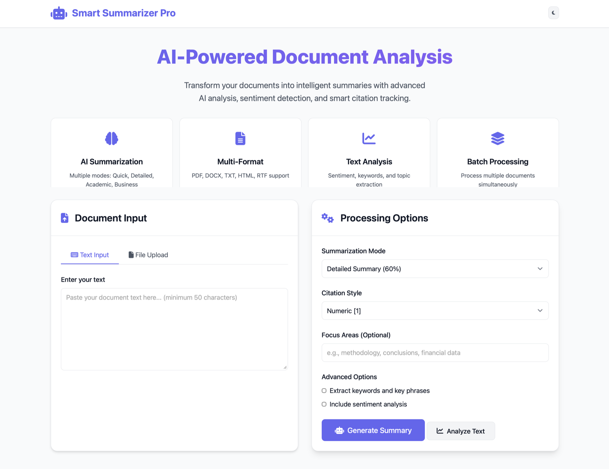
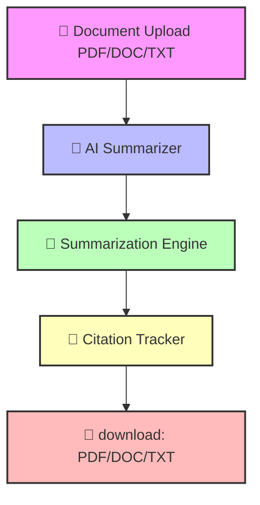

<!-- Smart Summarizer Screenshot Preview -->
<picture align="right" style="
  display: inline-block;
  float: right;
  margin: 10px 0 20px 20px;
  border-radius: 18px;
  overflow: hidden;
  box-shadow: 0 4px 25px rgba(0, 255, 255, 0.2);
  transition: transform 0.3s ease, box-shadow 0.3s ease;
">
  <source media="(prefers-color-scheme: dark)" 
          srcset="@/public/images/summarizer-dark.png">
  <source media="(prefers-color-scheme: light)" 
          srcset="@/public/images/summarizer-light.png">
  
</picture>


---
<h1 align="center">⚡ Smart Summarizer Pro ⚡</h1>

<h3 align="center">AI-Powered Document Summarization with Citation Tracking</h3>

<p align="center">
  <a href="https://smart-summarizer-pro.vercel.app/">
    
  </a>
</p>

---

## 🌌 Overview

> **Challenge:** Reading lengthy research papers or legal documents takes hours.  
> **Solution:** Smart Summarizer Pro uses **AI + NLP** to **automatically summarize** content while **preserving citations** — saving time, maintaining accuracy, and improving productivity.  

---

## 🧠 Key Highlights

💫 **AI-Powered Summaries** — Extractive + Abstractive models for high-quality insights.  
📑 **Citation Tracking** — Retains sources and references precisely.  
📄 **Multi-Format Output** — Export to PDF, DOCX, or TXT instantly.  
⚙️ **Real-Time Processing** — Fast summarization with cloud acceleration.  
🌍 **Accessible Anywhere** — Cross-platform support via browser.  

---

## 🧩 Architecture Flow


---

## 🔄 Workflow

### Step	Action	Description
- 🧾 1. Upload	User uploads PDF/DOCX/TXT	Drag & drop or browse file
- 🤖 2. AI Summarization	NLP engine processes text	Uses transformer-based models
- 🔗 3. Citation Tracking	Extracts & preserves sources	Ensures traceable references
- 💾 4. Export Summary	Download summary file	PDF / DOCX / TXT formats


---

## 🪄 Features at a Glance

✨ Automatic Summarization (Short / Medium / Long)
📚 Accurate Citation Linking
📁 Multi-format Support (PDF / Word / Text)
🔍 AI-Powered Highlight & Search
🧠 Abstractive + Extractive Modes
☁️ Cloud Integration for Scalability

---

## 💻 Tech Stack

<div align="center">


### Layer	Technology
- 🎨 Frontend	 
- ⚙️ Backend	 
- 🧠 AI/NLP	  
- 🗄️ Database	 
- ☁️ Cloud	 
- 🧩 Utilities	  

</div>


## ⚙️ Installation & Setup

### Clone the Repository
```
git clone https://github.com/manishpatil55/smart-summarizer.git
```
```
cd smart-summarization
```

### Install dependencies
```
npm install
```
```
pip install -r requirements.txt
```

### Run backend
```
npm run server
```

### Run frontend
```
npm start
```


## 🎯 Real-World Applications

Sector	Use Case
- 🎓 Education	Summarize research papers and academic notes
- ⚖️ Legal	Summarize case documents and retain citations
- 💼 Corporate	Extract insights from lengthy reports
- 🗞️ Media & Journalism	Generate summaries for articles and news


---

## 🔮 Future Roadmap

### 🚀 Feature	🌟 Description
- 🌍 Multi-Language Support	Summarize documents in global languages
- 🔎 Google Scholar Integration	Auto-fetch citations for academic sources
- 🛡️ Plagiarism & Authenticity Checker	Detect duplicated content
- 🎙️ Voice Summary Reader	Listen to AI-generated summaries
- 📱 Mobile App Version	Summarize on-the-go


---

📜 License

<div align="center" style="border:2px solid #4CAF50; border-radius:12px; padding:20px; margin:10px; background: linear-gradient(135deg, #E8F5E9, #A5D6A7); width: 80%;">
<h3>📝 MIT License</h3>
<p>This project is licensed under the MIT License – <b>Smart Summarizer Pro v2.0.0</b></p>
</div>


---


<h3 align="center">🌐 Explore Live Demo</h3>
<p align="center">
  <a href="https://smart-summarizer-pro.vercel.app/">
    
  </a>
</p>


---


<p align="center">
  <b>💡 Transform Documents → Smarter Summaries with AI.</b><br>
  Made with ❤️ by <b>Team Smart Summarizer Pro</b>.
</p>


---

<!-- Header Section -->
<p align="center">
  
  
  
  
</p>
