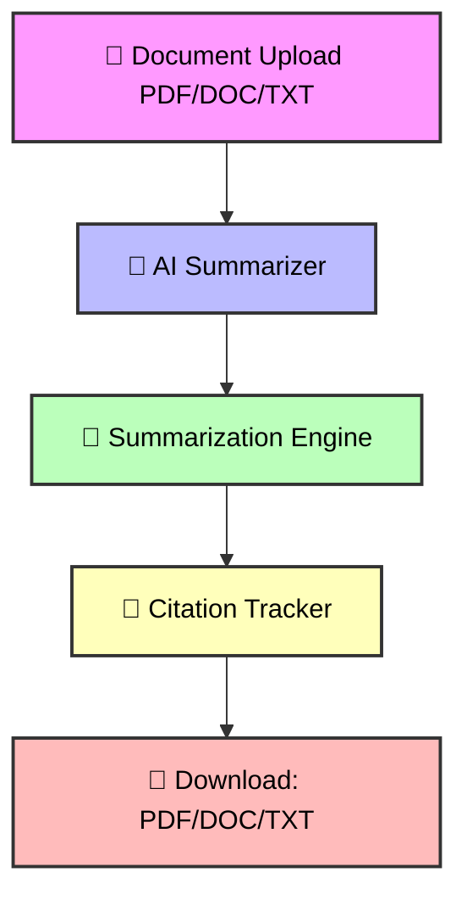

<!-- Smart Summarizer Screenshot Preview -->
<a href="https://smart-summarizer-pro.vercel.app/">
  <picture> 
    <source media="(prefers-color-scheme: dark)" srcset="public/images/summarizer-dark.png">
    <source media="(prefers-color-scheme: light)" srcset="public/images/summarizer-light.png">
    
  </picture>
<a>

---
<h1 align="center">⚡ Smart Summarizer Pro ⚡</h1>

<h3 align="center">AI-Powered Document Summarization with Citation Tracking</h3>

<p align="center">
  <a href="https://smart-summarizer-pro.vercel.app/">
    
  </a>
</p>

---

## 🌌 Overview

> **Challenge:** Reading lengthy research papers, legal documents, or corporate reports takes hours.  
> **Solution:** Smart Summarizer Pro leverages **AI + NLP + Google Gemini API** to **automatically summarize** content while **preserving citations** — saving time, maintaining accuracy, and boosting productivity.  

---

## 🧠 Key Highlights

💫 **AI-Powered Summaries** — Using **Google Gemini API** with extractive & abstractive NLP models.  
📑 **Citation Tracking** — Retains sources and references precisely.  
📄 **Multi-Format Output** — Export summaries to PDF, DOCX, or TXT.  
⚙️ **Real-Time Processing** — Fast cloud-based summarization.  
🌍 **Accessible Anywhere** — Browser-friendly, cross-platform.  

---

## 🧩 Architecture Flow



---

## 🔄 Workflow

### Step	Action	Description
- 🧾 1. Upload	User uploads PDF/DOCX/TXT	Drag & drop or browse file
- 🤖 2. AI Summarization	NLP engine powered by Google Gemini API	Extractive & abstractive summaries
- 🔗 3. Citation Tracking	Extracts & preserves sources	Ensures traceable references
- 💾 4. Export Summary	Download summary file	PDF / DOCX / TXT formats


---

## 🪄 Features at a Glance

- ✨ Automatic Summarization (Short / Medium / Long)
- 📚 Accurate Citation Linking
- 📁 Multi-format Support (PDF / Word / Text)
- 🔍 AI-Powered Highlight & Search
- 🧠 Abstractive + Extractive Modes

---

## 💻 Tech Stack

### Layer	Technology
- 🎨 Frontend	React, Next.js
- ⚙️ Backend	Node.js, Express
- 🧠 AI/NLP	Google Gemini API
- 🗄️ Database	Firebase, MongoDB
- ☁️ Vercel Hosting
- 🧩 Utilities	PyPDF2, SpaCy, LangChain


---

## ⚙️ Installation & Setup

### Clone the Repository
```
git clone https://github.com/manishpatil55/smart-summarizer.git
```
```
cd smart-summarization
```

### Install dependencies
```
npm install
```
```
pip install -r requirements.txt
```

### Run backend
```
npm run server
```

### Run frontend
```
npm start
```
---

## 🎯 Real-World Applications

### Sector	Use Case
- 🎓 Education	Summarize research papers and academic notes
- ⚖️ Legal	Summarize case documents and retain citations
- 💼 Corporate	Extract insights from lengthy reports
- 🗞️ Media & Journalism	Generate concise summaries for articles and news


---

## 🔮 Future Roadmap

### Feature	Description
- 🌍 Multi-Language Support	Summarize documents in multiple languages
- 🔎 Google Scholar Integration	Auto-fetch citations for academic sources
- 🛡️ Plagiarism & Authenticity Checker	Detect duplicated content for reliability
- 🎙️ Voice Summary Reader	Listen to AI-generated summaries
- 📱 Mobile App Version	Real-time summaries on mobile devices


---

## 📜 License

<div align="center" style="border:2px solid #4CAF50; border-radius:12px; padding:20px; margin:10px; background: linear-gradient(135deg, #E8F5E9, #A5D6A7); width: 80%;">
<h3>📝 MIT License</h3>
<p>This project is licensed under the MIT License – <b>Smart Summarizer Pro v2.0.0</b></p>
</div>


---


<h3 align="center">🌐 Explore Live Demo</h3>
<p align="center">
  <a href="https://smart-summarizer-pro.vercel.app/" target="_blank">
    
  </a>
</p>


---

<p align="center">
  
  
  
  
  
</p>


---

