<p align="center">
  
  
  
  
</p>

---

<h1 align="center">📄 AI-Powered Document Summarization with Citation Tracking 🚀</h1>


## 🌟 Overview
> ⚡ **Problem:** Reading long documents is time-consuming.  
> ⚡ **Solution:** AI summarizes documents **automatically** with **citations intact**.  


# <span style="background: linear-gradient(90deg, #FF8A65, #FF5722); color:white; padding:5px 12px; border-radius:5px;">🤖 AI-Powered Document Summarization with Citation Tracking</span>

---

## <span style="background: linear-gradient(90deg, #FF8A65, #FF5722); color:white; padding:5px 10px; border-radius:5px;">🌟 Overview</span>

<div style="border:2px solid #2196F3; border-radius:15px; padding:20px; margin:10px; 
            background: linear-gradient(135deg, #BBDEFB, #64B5F6); 
            box-shadow: 3px 3px 12px rgba(0,0,0,0.2); width: 90%; text-align:left;">

<p>AI-Powered Document Summarization reduces reading time and ensures accurate citation tracking using <strong style="color:#FF9800;">AI</strong> and <strong style="color:#9C27B0;">NLP</strong>.</p>

<h4><span style="background: linear-gradient(90deg, #4CAF50, #81C784); color:white; padding:3px 8px; border-radius:3px;">💡 Key Objectives</span></h4>
<ul>
<li><span style="color:#FF5722; font-weight:bold;">Summarize</span> research papers, reports, articles, and legal documents.</li>
<li><span style="color:#4CAF50; font-weight:bold;">Preserve citations</span> accurately.</li>
<li>Multiple <span style="color:#FFC107; font-weight:bold;">output formats</span>: PDF, DOC, TXT.</li>
<li>Boost <span style="color:#2196F3; font-weight:bold;">productivity</span> and save reading time.</li>
<li>Easy <span style="color:#9C27B0; font-weight:bold;">sharing & export</span> functionality.</li>
</ul>

<h4><span style="background: linear-gradient(90deg, #FF9800, #FFB74D); color:white; padding:3px 8px; border-radius:3px;">🎯 Benefits</span></h4>
<ul>
<li>Save time ⏱️ for students, researchers, corporate teams, journalists, and legal professionals.</li>
<li>Reduce <span style="color:#4CAF50; font-weight:bold;">manual errors</span> in citation tracking.</li>
<li>Improve <span style="color:#00BFFF; font-weight:bold;">decision-making</span> by extracting key insights quickly.</li>
<li>Foster <span style="color:#FF5722; font-weight:bold;">efficient knowledge management</span> and information retrieval.</li>
</ul>
</div>

---

## 🏗️ Architecture Diagram

```mermaid
flowchart TD
    style A fill:#f9f,stroke:#333,stroke-width:2px
    style B fill:#bbf,stroke:#333,stroke-width:2px
    style C fill:#bfb,stroke:#333,stroke-width:2px
    style D fill:#ffb,stroke:#333,stroke-width:2px
    style E fill:#fbb,stroke:#333,stroke-width:2px

    A[📂 Document Upload PDF/DOC/TXT] --> B[🤖 AI Summarizer]
    B --> C[📝 Summarization Engine]
    C --> D[📑 Citation Tracker]
    D --> E[💾 download: PDF/DOC/TXT]

```

## 🔄 Step-by-Step Workflow

> **Visual guide to AI-Powered Document Summarization with Citation Tracking**:


<!-- Step 1 -->
<div style="border:2px solid #FFD700; border-radius:15px; padding:15px; margin:10px; background: linear-gradient(135deg, #FFF8DC, #FFFACD); width: 90%;">
<h3>1️⃣ 📂 Document Upload</h3>
<ul>
<li>User uploads PDF, DOCX, or TXT files</li>
<li>Drag & Drop or Browse option</li>
<li>Supported formats highlighted in UI</li>
</ul>
</div>

<!-- Step 2 -->
<div style="border:2px solid #00BFFF; border-radius:15px; padding:15px; margin:10px; background: linear-gradient(135deg, #E0FFFF, #B0E0E6); width: 90%;">
<h3>2️⃣ 🤖 AI Summarizer</h3>
<ul>
<li>Uses advanced NLP & AI models</li>
<li>Extractive and Abstractive summarization</li>
<li>Real-time processing for faster results</li>
</ul>
</div>

<!-- Step 3 -->


---

✨ Features

🔹 Automatic Summarization (Short / Medium / Long)

🔹 Citation Tracking with Source Links

🔹 Multi-format Support (PDF, DOCX, TXT)

🔹 Export Options (PDF/Word/Text)

🔹 Abstractive + Extractive Summaries

🔹 AI-powered Highlight & Search

---

## 🛠️ Tech Stack

<p align="center">
  
  
  
  
</p>

<p align="center">
  
  
  
</p>

<p align="center">
  
  
</p>

<p align="center">
  
  
</p>

<p align="center">
  
  
  
</p>


 
# Clone the Repository
git clone https://github.com/your-username/document-summarization.git
cd document-summarization

# Install dependencies
npm install
pip install -r requirements.txt

# Run backend
npm run server

# Run frontend
npm start
---

> ## 📊 Use Cases

> How **AI-Powered Document Summarization** helps different users:

<div align="center">

<table>
<tr>
<td align="center" style="padding:15px; border: 2px solid #FFD700; border-radius:12px; background-color:#FFF8DC;">
### 🎓 Students & Researchers
- ✅ Summarize research papers quickly  
- ✅ Track citations accurately  
- ✅ Save hours of reading ⏱️
</td>

<td align="center" style="padding:15px; border: 2px solid #2196F3; border-radius:12px; background-color:#E0F7FA;">
### ⚖️ Legal Sector
- ✅ Summarize long case documents  
- ✅ Accurate reference tracking  
- ✅ Reduce manual workload
</td>
</tr>

<tr>
<td align="center" style="padding:15px; border: 2px solid #


---

## 🚀 Future Enhancements


> Planned upgrades to make **AI-Powered Document Summarization** even more powerful:

<div align="center">

<table>
<tr>
<td align="center" style="padding:15px; border: 2px solid #FF5722; border-radius:12px; background-color:#FFEDE1;">
### 🌍 Multi-language Summarization
- Summarize documents in multiple languages  
- Expand global accessibility
</td>

<td align="center" style="padding:15px; border: 2px solid #4CAF50; border-radius:12px; background-color:#E8F5E9;">
### 🔎 Google Scholar Integration
- Fetch references directly from Google Scholar  
- Automate citation tracking
</td>
</tr>

<tr>
<td align="center" style="padding:15px; border: 2px solid #2196F3; border-radius:12px; background-color:#E3F2FD;">
### 🛡️ Plagiarism & Authenticity Checker
- Detect duplicated content  
- Ensure originality and reliability
</td>

<td align="center" style="padding:15px; border: 2px solid #9C27B0; border-radius:12px; background-color:#F3E5F5;">
### 🎙️ Voice-assisted Summary Reader
- Listen to AI-generated summaries  
- Ideal for multitasking & accessibility
</td>
</tr>

<tr>
<td align="center" colspan="2" style="padding:15px; border: 2px solid #FFA000; border-radius:12px; background-color:#FFF8E1;">
### 📱 Mobile App Version
- Access summaries on mobile devices  
- Real-time AI summarization on-the-go
</td>
</tr>
</table>

</div>
```
---
## 👨‍💻 Team

> Meet the amazing team behind **AI-Powered Document Summarization**:

<div align="center">

<table>
<tr>
<td align="center" style="padding:15px; border:2px solid #2196F3; border-radius:12px; background: linear-gradient(135deg, #BBDEFB, #64B5F6); width:200px;">
<h3>1️⃣ Manish</h3>
<p>Project Lead & Backend Developer</p>
</td>

<td align="center" style="padding:15px; border:2px solid #4CAF50; border-radius:12px; background: linear-gradient(135deg, #C8E6C9, #81C784); width:200px;">
<h3>2️⃣ Ajay Gaikawad</h3>
<p>AI Engineer & NLP Specialist</p>
</td>

<td align="center" style="padding:15px; border:2px solid #FF9800; border-radius:12px; background: linear-gradient(135deg, #FFE0B2, #FFB74D); width:200px;">
<h3>3️⃣ Farheen Deshmukh</h3>
<p>Frontend Developer & UI/UX Designer</p>
</td>
</tr>
</table>

</div>
```
---
## 📜 License

<div align="center">

<div style="border:2px solid #4CAF50; border-radius:12px; padding:20px; margin:10px; 
            background: linear-gradient(135deg, #E8F5E9, #A5D6A7); 
            box-shadow: 3px 3px 10px rgba(0,0,0,0.2); width: 80%;">

<h3>📝 MIT License</h3>
<p>This project is licensed under the MIT License –
# Smart Summarizer Pro v2.0.0
